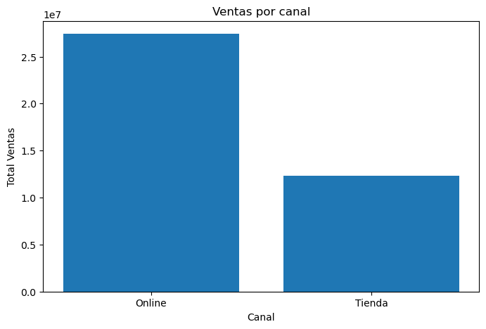
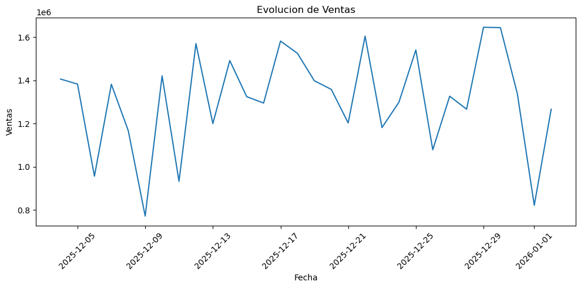
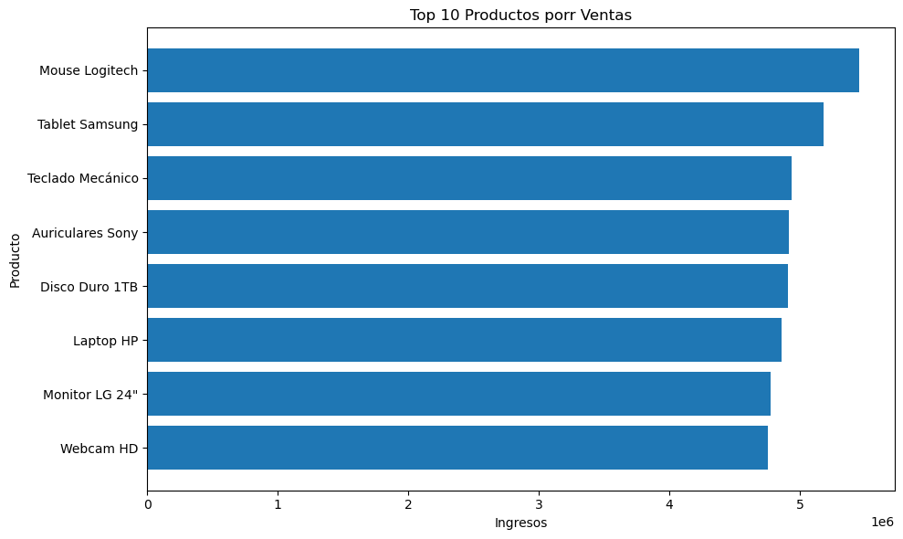
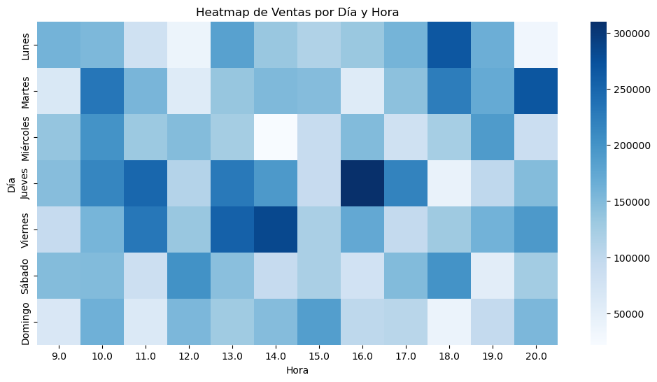
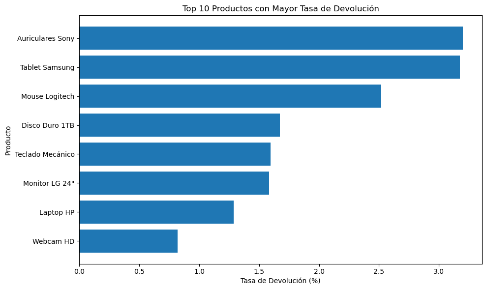

# 📊 Retail Sales Data Analysis Pipeline

## 📌 Overview

This project implements an end-to-end data analysis pipeline for retail sales, integrating data from physical stores and online channels.

The goal is to transform inconsistent, multi-source data into a clean, structured dataset and generate actionable business insights through automated reporting and visualizations.

---

## 🎯 Business Problem

Retail companies often operate with multiple data sources that:

* Use inconsistent formats
* Contain duplicates and missing values
* Lack standardization across channels

This project simulates a real-world scenario where these issues are addressed to enable reliable analysis and decision-making.

---

## ⚙️ Tech Stack

* **Python**
* **Pandas** – data manipulation
* **NumPy** – numerical operations
* **Matplotlib & Seaborn** – data visualization
* **OpenPyXL** – Excel report generation

---

## 🔄 Project Structure

```
retail-sales-data-analysis/
│
├── src/
│   ├── main.py
│   ├── cleaning.py
│   ├── transformation.py
│   ├── analysis.py
│   ├── visualization.py
│   ├── data_loader.py
│   └── config.py
│
├── images/
├── data/
│   └── sample_output/
│       └── reporte_final.xlsx
│
├── requirements.txt
├── README.md
└── .gitignore
```

---

## 🔧 Pipeline Process

### 1. Data Ingestion

* Load data from CSV and Excel files
* Multiple sources: store sales, online sales, product catalog, returns

### 2. Data Cleaning

* Remove duplicates
* Standardize date formats
* Clean price fields
* Normalize categorical variables
* Handle invalid emails

### 3. Data Transformation

* Merge datasets from different sources
* Standardize schema
* Create unified dataset

### 4. Feature Engineering

* Total sales and cost
* Gross margin and margin %
* Day of week (Spanish)
* Week of month
* Time of day segmentation

### 5. Returns Analysis

* Identify returned transactions
* Calculate return rates:

  * By product
  * By channel

### 6. Reporting & Visualization

* Automated Excel report generation
* Multiple visualizations for insights

---

## 📈 Key Outputs

### 📊 Visualizations







---

### 📄 Excel Report

Includes:

* General summary
* Top products
* Sales by store
* Returns analysis

📁 Location:

```
data/sample_output/reporte_final.xlsx
```

---

## 🚀 How to Run

1. Clone the repository:

```
git clone https://github.com/your-username/retail-sales-data-analysis.git
```

2. Install dependencies:

```
pip install -r requirements.txt
```

3. Run the pipeline:

```
python src/main.py
```

---

## 💡 Key Insights (Example)

* Online channel generates higher total revenue
* Physical stores show stronger profit margins
* Certain products have significantly higher return rates
* Sales peak during specific hours and weekdays

---

## 🔮 Future Improvements

* Integration with Power BI or Tableau dashboards
* Pipeline automation (e.g., scheduling with Airflow)
* Data validation and anomaly detection
* Cloud deployment (AWS / Azure)

---

## 👤 Author

**Rodrigo Frías Perdomo**
Industrial Engineering | Data Analysis

---

## 🧠 Notes

Outputs are generated dynamically and are not fully stored in the repository.
Only selected samples are included for demonstration purposes.
